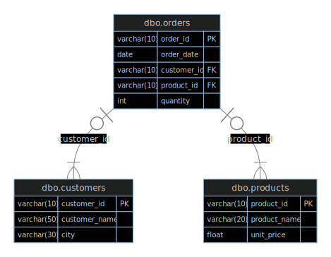

# Sales Database SQL

This repository contains SQL scripts for creating and managing a simple sales database. The primary purpose of this project is to provide a schema for storing and organizing sales-related data, including products, customers, and orders.

## 📁 Contents

- **Schemas.sql**  
  SQL statements to create the Sales database tables (`products`, `customers`, `orders`).

- **Insert_Queries.sql**  
  Sample data to populate the tables with products, customers, and orders.

- **Exercises.sql**  
  Practice SQL questions and sample queries covering SELECT, JOIN, GROUP BY, filtering, and aggregation.

## Database Structure

- **products**: Stores product details (`product_id`, `product_name`, `unit_price`)
- **customers**: Stores customer information (`customer_id`, `customer_name`, `city`)
- **orders**: Stores sales order data (`order_id`, `order_date`, `customer_id`, `product_id`, `quantity`), linking customers and products


## Usage

### 1. Clone This Repo

```sh
git clone https://github.com/blvckjoy/sales-database-sql.git
cd sales-database-sql
```

### 2. Create the Database Tables

Run the commands in `Schemas.sql` to create the tables.

### 3. Insert Sample Data

Run the commands in `insert_queries.sql` to populate the tables.

### 4. Practice SQL

Try the queries in `Exercises.sql` or write your own!

## Requirements

- SQL Server or compatible database system that supports T-SQL.

## License

This project is open-source and free to use for learning and personal projects.

---

Happy querying! 🚀
